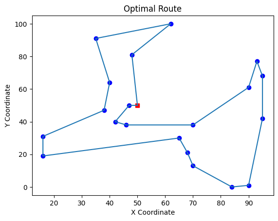

# Traveling Salesman Problem (TSP) Solver Using Genetic Algorithm

This repository contains a Python implementation of the Traveling Salesman Problem (TSP) solver using a Genetic Algorithm (GA). The TSP is a well-known optimization problem where the objective is to find the shortest possible route that visits a given set of locations exactly once and returns to the starting point.

## Features

- **Random Location Generation**: Generates random coordinates for the locations that need to be visited.
- **Genetic Algorithm Implementation**: Uses a genetic algorithm to find an optimal or near-optimal solution for the TSP.
- **Route Visualization**: Plots the optimal route found by the algorithm.

## Prerequisites

To run this project, you'll need the following Python packages:

- `numpy`
- `matplotlib`
- `deap`

You can install them using pip:

```bash
pip install numpy matplotlib deap

```

## How It Works

1. **Location Setup**: The program generates a set of random locations and a central depot where the route starts and ends.
2. **Genetic Algorithm**:
    - **Initialization**: The initial population of routes is generated randomly.
    - **Selection**: The best individuals (routes) are selected using tournament selection.
    - **Crossover**: Selected routes are combined using partially matched crossover to create new offspring.
    - **Mutation**: Some routes undergo mutation where elements (locations) are shuffled.
    - **Evaluation**: The fitness of each route is evaluated based on the total distance traveled.
3. **Visualization**: The best route found by the genetic algorithm is plotted.

## Running the Code

To run the code, simply execute the `main` function in the `tsp_solver.py` script:

```bash
python tsp_solver.py
```

The algorithm will generate a plot of the optimal route once it completes the computation.

## Example

Here's an example of the output route visualization:



## Repository Structure

- `tsp_solver.py`: Main script containing the implementation of the genetic algorithm for the TSP.
- `README.md`: This file, explaining the project and how to use it.
- `example_route.png`: Example output image (optional; you can include this if you have a pre-generated plot).

## Customization

- **Number of Locations**: You can change the `num_locations` variable in the code to test the algorithm on different problem sizes.
- **Depot Location**: The `depot` is currently set to a fixed point `(50, 50)` but can be customized.
- **Genetic Algorithm Parameters**: Parameters such as population size, crossover probability, and mutation probability can be adjusted for experimentation.

## License

This project is licensed under the MIT License - see the [LICENSE](LICENSE) file for details.

## Contributing

Contributions are welcome! If you have ideas to improve this project, feel free to fork the repository and submit a pull request.

## Contact

For any inquiries, please contact [Your Name] at [your.email@example.com].
```

### Notes:
- Replace `[Your Name]` and `[your.email@example.com]` with your actual name and email.
- If you include a pre-generated plot, save it as `example_route.png` in the repository, so it matches the reference in the `README.md`.
- If you include a license file, ensure the `LICENSE` link is correct in the License section.
